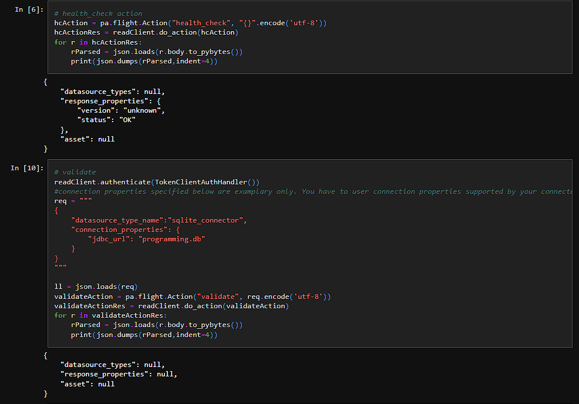
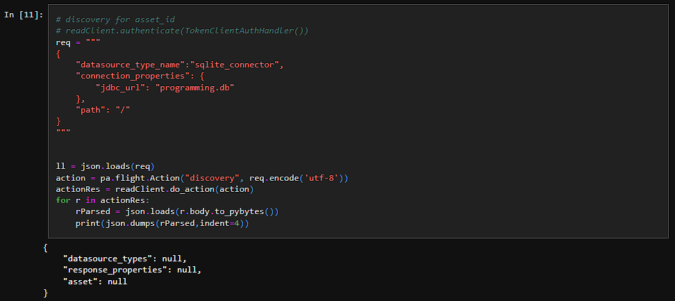

# Apache-Arrow-Flight-SQLite-Connector

## Launch guide
*Tested and implemented on Fedora 38 operating system*

1. Clone repository
2. Navigate to '\sdk-gen' folder
3. Start docker service using `systemctl start docker`
4. Build docker image using `./gradlew dockerBuild`
5. Start docker image using `./gradlew dockerStart -Pdocker.publish.https=443:9443`
6. To stop docker image use `./gradlew dockerStop`

To check the log file use `docker exec -it wdp-connect-sdk-gen-flight bash`. The navigate to the '\log' folder and use `cat trace.log / tail -f trace.log`.

## Implementation done 

- We successfully built, started our docker image and created sample project,
- We parametrized our connector to work with our data source (SQLite),
- We converted initially created connector template to extend from JdbcConnector instead of RowBasedConnector,
- While trying to connect via Python Client (Flight-client-notebook.ipynb), we were able to go through the following actions:
  - list_actions,
  - health_check,
  - authenticate,
  - validate,
  - discovery (not implemented).

## Encountered problem

While testing our connector we noticed that the Python Client returns nulls in several places (see images below): 
  
  
 
We don't know why the Python Client returns the nulls. We think that it isn't able to connect. The log file doesn't show any errors.
